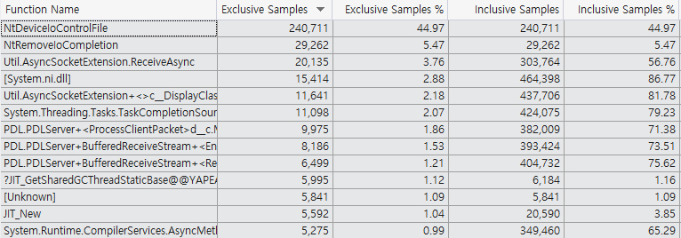

최근 회사에서 c#으로 네트워크 프로그래밍을 하고 있다. 일은 아니고 그냥 개인의 취향
나름 c#도 속도가 괜찮다는 것을 보여주려고 시작을 했는데, 진행하면서 점점 보이는 결과는 영 좋지 않다.

서버 과부하 테스트 프로그램을 c#으로 porting했다. 정말 과부하 테스트를 하려면 c++로 작성해야 맞지만 테스트 로직까지 c++로 작성하면 골치가 아프니 core는 c++, logic은 c#으로 작성하는 방법을 고민하면서 porting을 하고 있다. 하지만 그 전에 귀찮으니 일단 network core도 c#으로 작성했고 이 때 c# async io와 async/await을 대충 섞어서 작성했다.

**정말 대충 짰더니 정말 성능이 대충 나온다(...)**
vs analyze 기능을 통해 확인을 해보면 가장 오래 걸리는 부분이 mswsock.dll에 소속되어 있다고 나온다. 이 글은 대체 왜 mswsock.dll인가에 대한 고찰을 담은 글이다.

.net `Socket`의 `BeginReceive`, `EndReceive` 함수를 사용하면 내부에서 pinvoke로 `WSARecv` 함수를 부르게 된다. `WSARecv` 함수는 `ws2_32.dll`에 정의된 함수로 얼핏보기에는 socket 확장 api가 담겨있는 `mswsock.dll`이 부를 필요가 없어 보인다. 이를 정확히 확인하기 위해 ms symbol server에서 clr 관련 symbol을 받고 다시 profiler를 돌려보았다.

진범이 나온 것 같다. `NtDeviceIoControlFile()`과 `NtRemoveIoCompletion()`이 1, 2위로 나왔다. 여기서 `NtRemoveIoCompletion()` 함수는 `GetQueuedCompletionStatus()` 때문에 불리는 것으로 추측되니 `NtDeviceIoControlFile()`의 정체만 밝히면 되겠다.

간단히 calling, called를 확인해보자.

원인이 명확해졌다.
다량의 패킷 수신자가 `WSARecv`를 부르는 과정에서 `ws2_32.dll`의 함수가 호출된 것은 당연했다. 하지만 그 과정에서 알 수 없는 오류가 발생했고, 그 오류를 처리하기 위해 불린 `NtStatusToSocketError()` 함수가 `mswsock.dll`의 `NtDeviceIoControlFile()` 함수를 불렀던 것이다.

그렇다면 `NtDeviceIoControlFile()` 함수는 대체 무엇일까, 그리고 왜 그렇게 느릴까?
profiling한 결과를 보면 대부분의 exclusive sample의 address가 비슷한 지점을 가리키고 있는 것을 확인할 수 있다. 즉, 특정 지점에서 많이 멈춰있다는 이야기일 것인데, 이 때 cpu 사용량이 꽤 높다는 점을 미루어볼 때 뭔가 busy waiting을 하는 것이 아닐까 추측된다.

이 부분은 symbol 만으로 확인하기는 어렵고, 직접 disassemble을 해서 확인을 하던가 해야하지만 별로 그러고 싶지는 않고(...) 일단 pinvoke로 직접 iocp를 호출하는 c# 코드를 작성하여 그 부분에서도 여전히 비슷한 문제가 발생하는지 확인을 해봐야겠다.
