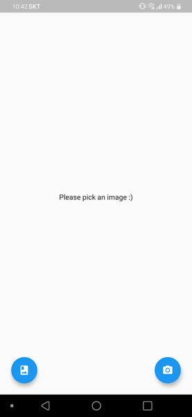
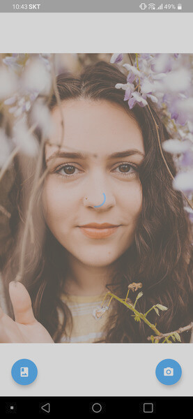

[GitHub Python trending](https://github.com/trending/python?since=daily)을 보다보면 재미있는게 참 많이 올라온다. Python이어서 더욱이 다른 언어보다 Machine Learning 관련된 것들이 많이 올라오는데, 관련 지식도, GPU도 없는 나로써는 대부분 그림의 떡에 불과하다.

그러다가 가끔 [ArtLine](https://github.com/vijishmadhavan/ArtLine)처럼 친절한 예제와 바로 실행해볼 수 있는 [CoLab](<https://colab.research.google.com/github/vijishmadhavan/Light-Up/blob/master/ArtLine(Try_it_on_Colab).ipynb>)까지 제공해주는 것들이 올라오는데, 결과물도 썩 괜찮고 CPU로도 속도가 어느 정도 나오는 모델을 발견하게 되면 간단히 서버리스로 올려두고 싶은 마음이 생긴다(?)

이번 글에서는 다음 과정에 대해서 간략히 정리한다.

1. 이런 Python 모델을 AWS Lambda + API Gateway에 올려서 서비스해보자.
2. 이 때 AWS Lambda가 Container image를 지원하니 이를 써보자.
3. 간단한 Flutter app을 만들어서 사진을 찍고, 그 결과를 1)의 API로 변환하여 노출해보자.

결과물은 [github.com/lacti/artline](https://github.com/lacti/artline)에 올려두었다. 물론 정리가 좀 많이 필요한 상태이다.

### Lambda Container image

AWS Lambda의 가장 큰 문제로 부족한 코드 공간을 꼽을 수 있는데, 기존 환경에서는 `/var/task` 에서 사용할 수 있는 **250MB** 와 `/tmp` 에 사용할 수 있는 **512MB** 내에서 어떻게든 코드를 잘 배치하여 사용했어야만 했다.

하지만 [지난 12월 1일부터 Container image를 지원](https://aws.amazon.com/ko/about-aws/whats-new/2020/12/aws-lambda-now-supports-container-images-as-a-packaging-format/)하기 시작하면서 [이제 ECR에 Docker image를 올리고 Lambda에서 그를 사용](https://docs.aws.amazon.com/lambda/latest/dg/images-create.html)할 수 있게 되었다. `pytouch` 나 `tensorflow` 의 경우 모두 pip으로 설치되는 `.so` 파일들의 용량이 굉장히 크기 때문에 기존 `/var/task` + `/tmp` 의 조합으로도 도저히 용량 문제를 해결하기 힘든 경우가 종종 있었는데, 이제 최대 10GB 크기의 Docker image를 사용할 수 있기 때문에 별 고민 없이 쉽게 배포할 수 있다.

물론 다음과 같은 제약이 있다.

- 아직 한국 region을 지원하지 않는다.
- Image 용량이 클수록 cold start 시간이 길어진다. 단, layer별로 이미 pull된 부분에 대해서는 다음 cold start 시에도 어느 정도 재사용되는 듯한 느낌이 있어, Docker image layer를 잘 만들면 재배포 이후에도 cold start를 크게 걱정하지 않아도 될 수 있다.
- 본 글에서 대충 만들게 될 약 4GB 수준의 Image는 API Gateway의 max timeout인 30초 내에서는 절대 기동될 수 없다. Image pull 받다가 timeout이 발생한다.

하지만 ML 모델을 Lambda에 배포하는 것부터가 적어도 병렬성을 위했으면 위했지 단건 처리의 속도를 위한 것은 전혀 아니므로 어느 정도 Cold start는 감수해야 한다. _개별 건의 처리 속도가 중요하다면 당연히 dedicate GPU 머신을 사용해야 한다._

### Backend 만들기

원래 잘 사용하는 [Serverless.js](https://www.serverless.com/)에서는 왠지 Python 지원도 깔끔하지 않고 Docker에 대해서도 잘 지원할 것 같지 않아 [sam-cli](https://github.com/aws/aws-sam-cli)를 써보기로 했다. 이 방법에 대해서는 [Using container image support for AWS Lambda with AWS SAM](https://aws.amazon.com/ko/blogs/compute/using-container-image-support-for-aws-lambda-with-aws-sam/)에서 자세히 나와있기 때문에 필요한 부분만 간단하게 짚고 넘어갈 예정이다.

```bash
pip install -u aws-sam-cli
sam init
```

기본으로 만들어지는 `hello_world` 함수를 적당히 `transform` 으로 변경하고 그에 맞게 `template.yaml` 도 수정해준다. 메모리가 얼마나 필요할지는 모르겠지만 일단 **2GB** 정도 주고, API Gateway에서 어떻게든 실행하겠다는 의지를 갖고 timeout은 **30**을 준다. _앞에서 간단히 이야기했지만, Docker image가 상당히 커지기 때문에 첫 번째 요청은 거의 무조건(?) timeout이 발생한다. 이 문제를 간단히 해결하려면 적당히 [warmup](https://www.serverless.com/plugins/serverless-plugin-warmup) 해두거나 혹은 [reserved concurrency](https://docs.aws.amazon.com/lambda/latest/dg/configuration-concurrency.html)를 하면 된다._

```yaml
Resources:
  TransformFunction:
    Type: AWS::Serverless::Function
    Properties:
      PackageType: Image
      MemorySize: 2048
      Timeout: 30
      Events:
        HttpPost:
          Type: Api
          Properties:
            Path: /transform
            Method: post
    Metadata:
      Dockerfile: Dockerfile
      DockerContext: ./transform
      DockerTag: python3.8-v1
```

이제 [`transform/app.py`](https://github.com/lacti/artline/blob/master/be/transform/app.py) 를 작성해보자. 이미 [ArtLine](https://github.com/vijishmadhavan/ArtLine)에서 코드가 다 정리되어 있으므로 이를 가져와서 다음과 같이 살짝만 정리해준다.

```python
# ...
from art_line import FeatureLoss  # For pickle

# Copy from https://github.com/vijishmadhavan/ArtLine
learn = load_learner(Path(os.path.dirname(__file__)), 'ArtLine_500.pkl')

def _artline_apply(input_path: str, output_path: str):
    img = PIL.Image.open(input_path).convert("RGB")
    img_t = T.ToTensor()(img)
    img_fast = Image(img_t)

    p, img_hr, b = learn.predict(img_fast)

    # Thanks for https://github.com/vijishmadhavan/ArtLine/issues/10
    output = img_hr.cpu().data[0]
    o = output.numpy()
    o[np.where(o < 0)] = 0.0
    o[np.where(o > 1)] = 1.0
    output = torch.from_numpy(o)
    output = T.ToPILImage()(output)
    output.save(output_path)
```

- 모델을 매번 로드하지 않도록 global scope에 선언했다. 이제 첫 요청만 느리다.
- Lambda handler와 `_artline_apply` 함수가 좀 더 효율적으로 데이터를 교환할 수 있지만 PoC이므로 간단하게 파일을 사용하여 결과를 공유하도록 한다.
- `ArtLine_500.pkl` 파일은 `__main__.FeatureLoss` class를 찾도록 되어있고 이게 없으면 모델을 가져오지 못한다. 때문에 해당 파일 내의 classpath를 적당히 `art_line.FeatureLoss` 로 수정해주고 이 파일을 import하여 `app.py` 가 `__main__` 이 되지 않더라도 모델을 정상적으로 불러올 수 있도록 처리해준다.
  - 실제 [`art_line.py`](https://github.com/lacti/artline/blob/master/be/transform/art_line.py) 내 `FeatureLoss` 는 존재만 하면 되므로 별도의 코드를 가질 필요가 없다.

이제 다음과 같은 Lambda handler를 작성하여 image를 변환해보도록 한다.

```python
def lambda_handler(event, context):
    if not "body" in event or len(event["body"]) == 0:
        return _response(400, "")

    temp_root = tempfile.mkdtemp()
    try:
        input_path = os.path.join(temp_root, "input.jpg")
        output_path = os.path.join(temp_root, "output.jpg")

        with open(input_path, "wb") as f:
            body_bytes = event["body"].encode('utf8')
            f.write(base64.decodebytes(body_bytes))
        _artline_apply(input_path, output_path)
        with open(output_path, "rb") as f:
            return _response(200, base64.encodebytes(f.read()))
    except:
        import sys
        import traceback
        print("Exception in user code:")
        print("-"*60)
        traceback.print_exc(file=sys.stdout)
        print("-"*60)
        return _response(500, "Internal Server Error")
    finally:
        shutil.rmtree(temp_root)
```

편의상 API Gateway payload로 변환할 이미지에 대한 base64를 직접 받는다. 당연히 제대로 만드려면 다음과 같이 해야 한다.

1. S3 signed url을 내려주고
2. app에서 그 주소에 사진을 upload한 후
3. Python Lambda에서 그 S3 key를 가지고 image를 변환하여 S3에 저장해두고
4. 그 결과를 app에서 가져가서 화면에 표시해야 한다.

최대한 간단하게 만드는 것을 목표로 했으므로, payload로 받은 base64를 image로 변환하여 변환 함수 `_artline_apply` 를 수행하고, 그 결과를 바로 API Gateway의 response payload로 반환한다. _[API Gateway의 max payload는 10MB이므로](https://docs.aws.amazon.com/en_us/apigateway/latest/developerguide/limits.html) 사전에 app에서 이미지를 올릴 때 적당한 크기로 줄여서 올리도록 처리했다._

이제 `requirements.txt` 를 정리해보자.

```text
fastai==1.0.61
numpy==1.17.2
pandas==1.1.2
torch==1.6.0
torchvision===0.7.0
Pillow==8.0.1
```

예전 방식이었다면 조금이라도 용량을 아끼기 위해 io watch를 걸고 프로그램을 실행하여 필요한 파일만 최소한으로 담고 그것도 `/var/task` 와 `/tmp` 에 나눠 담은 뒤 압축 풀고 `sys.path` 에 연결해주는 작업을 했겠지만, 이제는 `Dockerfile` 로 간편하게 처리하면 된다.

```Dockerfile
FROM public.ecr.aws/lambda/python:3.8

RUN yum update -y && yum install -y gcc && \
  pip install -U pip setuptools wheel

COPY requirements.txt ./
RUN python3.8 -m pip install -r requirements.txt -t .

COPY ArtLine_500.pkl ./
COPY app.py art_line.py ./

CMD ["app.lambda_handler"]
```

- `wheel` 과 `gcc` 가 설치되어야 `numpy` 가 제대로 설치될 수 있었다.
- 좀 더 세심하게 Docker image 용량을 줄인다면 Cold start를 조금이라도 더 줄일 수 있다.

### Backend 테스트 및 배포하기

`sam build` 로 위 내용에 대한 Docker image를 만들고, 이렇게 만든 image를 `sam local invoke` 나 `sam local start-api` 로 테스트 할 수 있다. **하지만 현재 `sam`의 버그인지 개발 환경 설정의 문제인지 Docker image가 갱신되어도 `local invoke/start-api` 가 새로 만들어진 image를 실행하지 못한다.**

작성한 `app.py` 파일 자체는 `__name__ == '__main__'` 검사해서 실행해보면 정상 동작하는지 알 수야 있지만 이게 Lambda에 올라가서 잘 동작한다는 보장을 하기는 어려우니 가급적이면 Docker로 정상 동작 여부를 검증해보고 싶다. 그런데 위 명령어가 잘 동작하지 않으니 다음과 같이 직접 하나씩 풀어서 실행해야 한다.

```bash
# Docker container 기동
docker run -p 9000:8080 transformfunction:python3.8-v1 app.lambda_handler

# 입력 만들기
echo "{\"body\":\"$(cat input.jpg | base64 | tr -d $'\n')\"}" > with-image.json

# 변환 수행 후 결과 출력
curl -XPOST \
  "http://localhost:9000/2015-03-31/functions/function/invocations" \
  -d @with-image.json | jq -r .body | base64 -d > output.jpg
```

이제 `sam deploy --guided` 로 배포를 진행하면 된다. 단, 아직 `ap-northeast-2` 에서는 AWS Lambda가 Container image를 지원하지 않기 때문에 현재 지원 중인 지역으로 바꿔서 배포를 해야 한다. 만약 그렇지 않다면 `Function` 을 만드는 과정에서 배포가 실패하는데, 에러 메시지가 뜬금없이 _Unable to determine service/operation name to be authorized_ 같은 형태로 나오기 때문에 괜히 시간만 버리게 된다.

정상적으로 배포되었다면 변환을 위한 POST API가 하나 생성되었을 것이다. 이제 다음과 같이 사용해볼 수 있다. 물론 첫 번째 요청은 높은 확률로 timeout이 발생할 것이고, 어느 정도 warmup된 상태라면 이미지에 따라 6~9초 정도 시간이 소요될 것이다.

```bash
time curl -s -XPOST \
  "https://API-URL/Prod/transform/" \
  -d "$(convert input.jpg -resize 1024x1024 - | base64 | tr -d $'\n')" \
  -o - | base64 -d > output.jpg
```

### app 만들기

API를 만들었으니 이를 사용하는 app을 간단히 만들어보자.

1. `Flutter` 를 사용할 것이고,
2. 사진을 찍은 후
3. 바로 서버에 요청하여 변환된 이미지를 얻고
4. 화면에 결과를 노출할 것이다.

Flutter도 생태가 잘 갖춰져 있기 때문에 저정도의 작업은 [이미 구현된 라이브러리를 사용](https://github.com/lacti/artline/blob/master/app/pubspec.yaml)하는 것으로 충분히 쉽게 구현할 수 있다.

Flutter의 구조에 대해 자세히 설명하지 않을 것이므로 간단히 사용한 라이브러리와 필수 함수의 내용에 대해서만 정리할 것이다. 전체 코드는 [main.dart](https://github.com/lacti/artline/blob/master/app/lib/main.dart)에서 확인할 수 있다.

- `image_picker` 사진을 찍거나 갤러리에서 사진을 선택하여
- `flutter_image_compress` 그 이미지를 _1024x1024_ 크기로 줄여서
- `http` 서버 API로 요청하여 그 결과를 받아
- `path_provider` App directory 내의
- `intl` 날짜 `yyyyMMddHHmmss` 이름의 파일로 결과를 저장할 것이다.
- 그리고 `loader_overlay` 그 동안 Loading indicator를 띄울 것이다.

`ImageSource`에 따라 사진을 찍거나 갤러리에서 사진을 가져온다. 그리고 그 이미지로 `transform` 함수를 수행한다.

```dart
Future getImage(ImageSource source) async {
  final pickedFile = await picker.getImage(source: source);
  setState(() {
    if (pickedFile != null) {
      _sourceImage = File(pickedFile.path);
      transform();
    }
  });
}
```

Loading indicator를 띄우고, 입력받은 이미지의 크기를 줄이고 서버에 업로드하여 그 결과를 받는다.

```dart
Future transform() async {
  try {
    context.showLoaderOverlay();

    final outputFile = await compressAndUploadImage(_sourceImage);
    setState(() {
      _transformedImage = outputFile;
    });
  } finally {
    context.hideLoaderOverlay();
  }
}
```

`flutter_image_compress` 라이브러리를 사용하여 입력받은 이미지를 _1024x1024_ 크기로 줄이고 그 내용을 base64로 만들어서 서버에 요청한다. 그리고 서버의 응답을 다시 base64로 해석해서 결과 파일에 담고 그 파일을 반환한다.

```dart
Future<File> compressAndUploadImage(File sourceImage) async {
  final compressed = await FlutterImageCompress.compressWithFile(
    sourceImage.path,
    minWidth: 1024,
    minHeight: 1024,
  );
  final payload = base64.encode(compressed);
  final response = await http.post(transformApiUrl,
      headers: {}, body: payload, encoding: Encoding.getByName('utf-8'));
  if (response.statusCode != 200) {
    throw new Exception('Server error ${response.statusCode}');
  }
  final appDir = await getApplicationDocumentsDirectory();
  final serial = DateFormat('yyyyMMddHHmmss').format(DateTime.now());
  final outputFile = File('${appDir.path}/$serial.jpg');
  final decoded =
      base64.decode(base64.normalize(response.body.replaceAll('\n', '')));
  await outputFile.writeAsBytes(decoded);
  return outputFile;
}
```

이제 화면에서 상황에따라 변환된 이미지 `_transformedImage` 혹은 원본 이미지 `_sourceImage` 를 보여주면 된다. 글의 길이 상 `_stage` 를 관리하는 부분은 생략했다.

```dart
Center(
  child: Column(
    mainAxisAlignment: MainAxisAlignment.center,
    children: <Widget>[
      _stage == Stage.Transformed
          ? Image.file(_transformedImage)
          : _sourceImage != null
              ? Image.file(_sourceImage)
              : Text("Please pick an image :)")
    ],
  ),
)
```

| 앱 시작 화면                                 | 사진 선택                                 | 사진 변환 후                             |
| -------------------------------------------- | ----------------------------------------- | ---------------------------------------- |
|  |  |  |

- [Photo by Kalen Kemp](https://unsplash.com/photos/xmdrV9B_M5g)

### 정리

한땀한땀 dependency를 주워가며 어떻게든 _250+512_ 안에 넣어 기어코 실행해내는 부분이 과거 AWS Lambda의 재미였다면, 이제는 고민없이 Docker로 쉽고 빠르게 배포할 수 있는 부분이 재미가 된 것 같다. 물론 Docker image의 용량이 Cold start latency에 지대한 영향을 끼치고, 이 때문에 처음 두 번의 요청이 각각 1) Docker image pull 받다가, 그리고 2) ML 모델 읽어오다가 발생하는 웃지 못할 상황도 있지만 가볍게 PoC를 해보거나 취미 프로젝트를 진행하는 수준으로는 손색이 없을 것 같다.

당연한 이야기이지만 _250+512_ 내에서 모든걸 최대한 세심하게 해결할 때보다 Docker image를 잘 구울 자신이 없다면 Cold start에서는 한 수 접고 들어가야 한다. 그럼에도 불구하고 배포 등의 이점이 너무 크기 때문에 왠만한 상황에서는 이 방법이 더 낫지 않을까 싶은데 이 경우 적어도 다음을 조심하면서 작업을 하면 좋지 않을까 생각한다.

- Docker image 크기를 최대한 줄여서 Cold start를 조금이라도 줄여보자.
- Local에서 Lambda 기반으로 테스트할 때와 API Gateway 기반으로 테스트할 때 Payload의 형태가 달라지므로 Local 테스트에 익숙해져보자. Local에서 잘 돌아간다면, 어지간해서 배포 후에도 잘 돌아간다는 뜻이므로 한결 개발이 예측 가능해질 수 있다.
- Cold start를 warmup이나 reserved concurrency로 해결해볼 수도 있겠지만 적당히 필요할 때 background에서 Lambda actor를 하나 띄워두고, S3를 매개로 파일을 교환하며 SQS나 Redis Q로 처리/완료를 교환하는 쪽으로 설계하는게 좀 더 시스템이 안정적이다.

취미로 하다보니 다소 엉성했지만 아무튼 AWS Lambda에 간단한 ML 모델을 올려서 이를 활용하는 app까지 개발해보았다. 이렇게 하나 template을 만들어두면 추후 또 괜찮은 ML 모델 올려서 장난 치는 것을 금방해 볼 수 있으니 앞으로 기대가 크다.
